# 🗺 Smart Trip Planner

Smart Trip Planner is a Flutter-based AI-powered travel itinerary generator.  
It allows users to create detailed day-by-day travel plans using Google Sign-In or Email authentication, powered by **Gemini AI** with fallback between **Gemini 1.5 Flash** and **Gemini 2.5 Pro** to ensure reliability even when one model is overloaded.

---

## ✨ Features

### 🔐 Authentication
- Google Sign-In (Firebase Auth)
- Email & Password sign-up/login
- Profile management (name update, logout)

### 🏠 Home Screen
- Greeting with username
- Prompt box for entering trip details
- **Create My Itinerary** button
- List of saved offline itineraries (user-specific)

### 🤖 AI-Generated Itineraries
- Generates itineraries using Gemini AI  
  - **Primary Model** → `gemini-1.5-flash` (fast & cost-efficient)  
  - **Fallback Model** → `gemini-2.5-pro` (if Flash is overloaded)  
- Structured by day, with time slots & activities
- Google Maps integration for each activity’s location
- Option to follow up with refinement requests
- Offline saving of itineraries

### 💬 Follow-Up Chat
- Chat-like interface for refining trips
- AI typing animation before response
- Copy response button
- Save updated itinerary offline

### 📂 Offline Saved Itineraries
- View saved itineraries anytime
- No input field, just display mode

### 👤 Profile Screen
- Avatar with first letter of username
- Display & edit username
- Email display
- Request & Response token counters
- Total cost calculation
- GitHub link button
- Logout

### ⚠ Error & Loading States
- Full-screen loading spinner during generation
- Error-specific UI (Quota exceeded, Model overload, No internet, Invalid JSON)

---

## 🛠 Tech Stack

| **Category**      | **Tools** |
|-------------------|-----------|
| **Frontend**      | Flutter (Dart) |
| **Backend / APIs**| Firebase Auth, Gemini AI API (`gemini-1.5-flash`, `gemini-2.5-pro`) |
| **Storage**       | Hive (Offline storage) |
| **Integrations**  | URL Launcher (Google Maps integration) |
| **Configuration** | Flutter Dotenv (Environment variables) |

💾 **Storage**
- Hive (Offline storage)

🌐 **Integrations**
- URL Launcher (Google Maps integration)

⚙ **Configuration**
- Flutter Dotenv (Environment variables)

---


## 🏗 App Architecture Flow

```mermaid
flowchart TD
    A[UI Layer - Flutter Screens <br/> Home, Chat, Profile, Itinerary View] 
      --> B[Service Layer <br/> Firebase Auth (Login/Signup), URL Launcher (Maps Integration)]
    
    B --> C[AI Logic Layer <br/> Gemini 1.5 Flash (Fast Responses), Gemini 2.5 Pro (Detailed Itineraries), Prompt Building & Parsing]
    
    C --> D[Local Storage Layer - Hive <br/> Save Itineraries Offline, Token & Cost Tracking]
    
    C --> E[Fallback Handling Layer <br/> Offline Mode Support, API Error Handling (503, JSON Errors), Loading States]
    
    D --> F[UI Update <br/> Refresh Screens with New Data]
    
    E --> F
```

---


## 📸 Screenshots

| Login | Sign Up | Home |
|-------|---------|------|
| 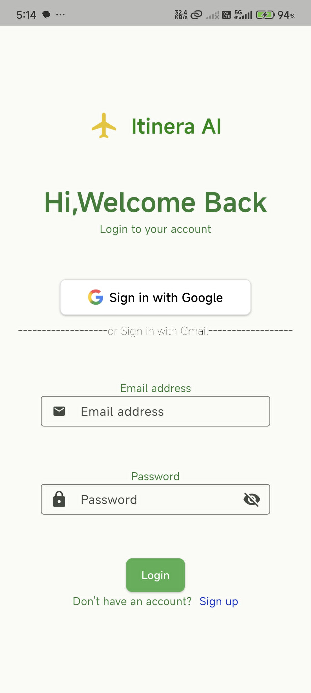 | 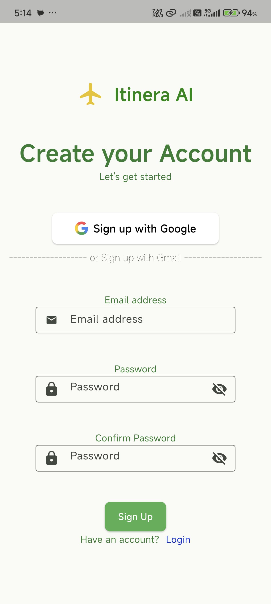 | 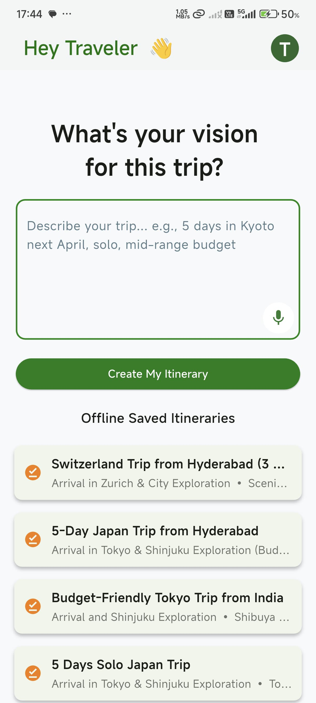 |

| Profile | Saved File (Read Mode) | Follow-Up Screen |
|---------|------------------------|------------------|
| 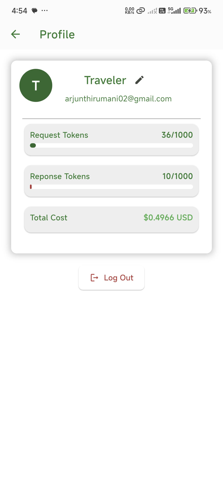 | 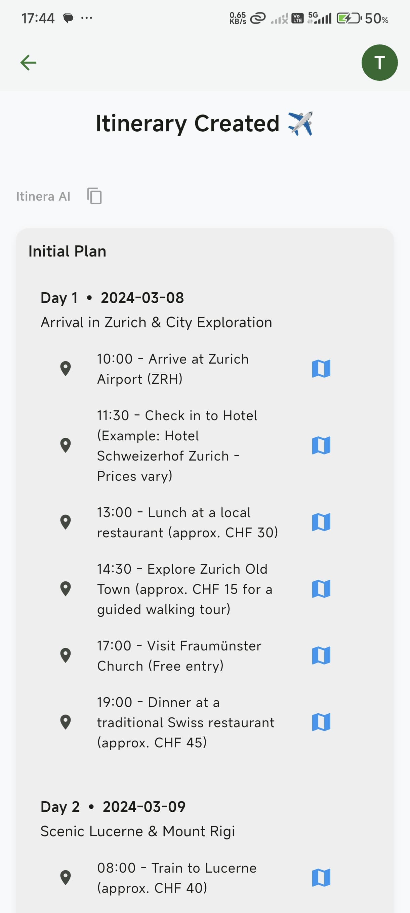 | 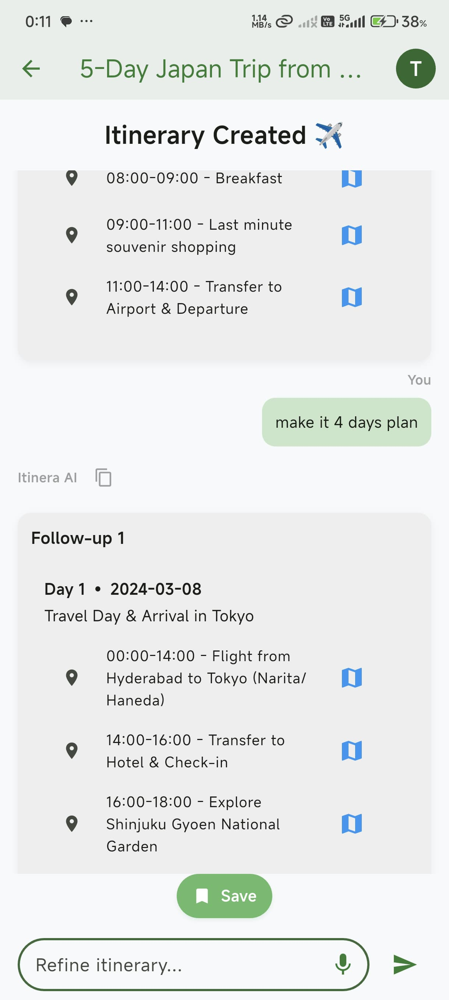 |

| Follow-Up Generating |  Loading Screen |
|----------------------|------------------|
| 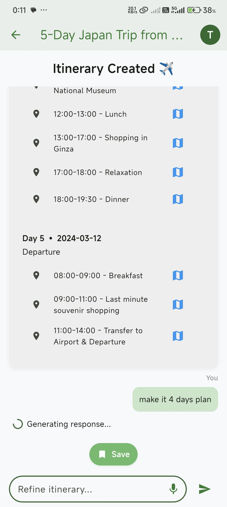 |  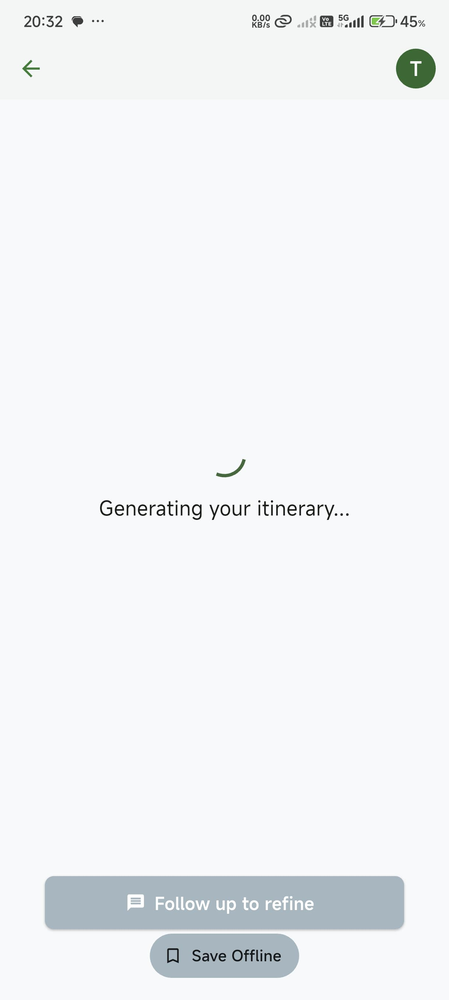 |


| Error - Quota | Error - Overload | Error - No Network |
|---------------|------------------|--------------------|
| 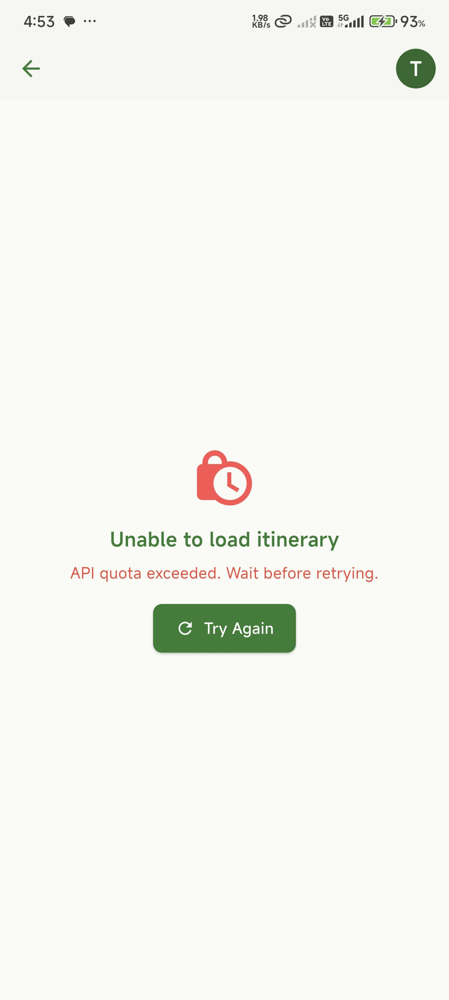 | 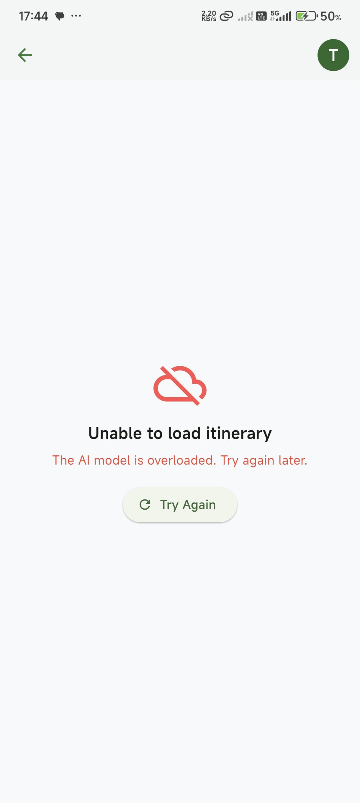 | 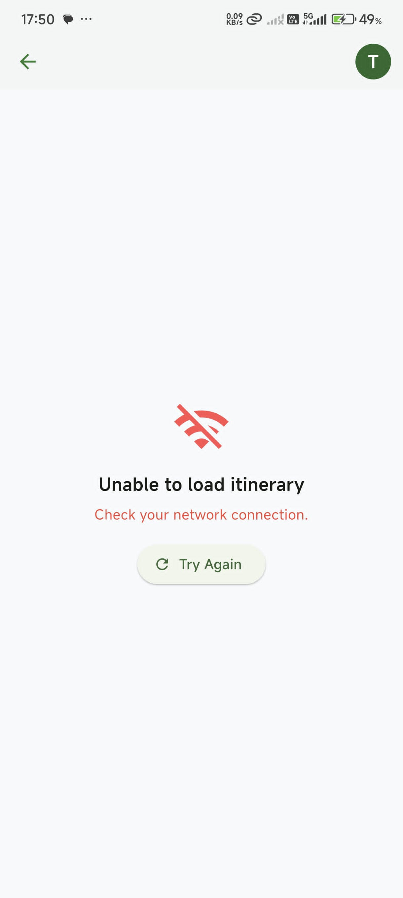 |

---

## 🔄 How the Agent Chain Works

1. **User enters a travel prompt** (e.g., “3-day trip to Manali for hiking and food”)
2. **Gemini 1.5 Flash is called** with the prompt
3. **If Flash fails** (due to overload or quota), fallback to **Gemini 2.5 Pro**
4. **API response** (structured day-by-day itinerary) is parsed and validated as JSON
5. Itinerary is shown in chat interface and can be saved offline
6. User can follow-up using chat → same agent is reused with context (history, last JSON, prompt)

---

## 💰 Token Cost (Mocked Per Request)

To help visualize API usage and cost in the UI, a **fixed cost-per-request model** was used instead of actual token counting:

| Action                       | Request Cost | Response Cost | Total |
|------------------------------|--------------|----------------|-------|
| Initial Itinerary Generation | \$0.05       | \$0.08         | **\$0.13** |
| Follow-Up Query              | \$0.05       | \$0.08         | **\$0.13** |
| Gemini 2.5 Pro Fallback      | \$0.05       | \$0.08         | **\$0.13** |

> These are **mock values** for demo purposes only. Actual token usage and pricing were not implemented.

### 📌 Why?
This mock model was used to:
- Help visualize cost tracking
- Keep implementation simple without real-time token breakdown
- Avoid unnecessary complexity during early-stage development

---


## 📦 Setup Instructions

### 1️⃣ Clone the Repository
```sh
git clone https://github.com/yourusername/Smart-Trip-Planner.git
cd Smart-Trip-Planner
```

### 2️⃣ Install Dependencies
```sh
flutter pub get
```

### 3️⃣ Configure Environment Variables
Create a `.env` file in the root directory:
```
GEMINI_FLASH_KEY=your_gemini_1_5_flash_api_key_here
GEMINI_PRO_KEY=your_gemini_2_5_pro_api_key_here
```

### 4️⃣ Run the App
```sh
flutter run
```

---

## 📂 Folder Structure

```
lib/
│
├── main.dart                # Entry point
├── firebase_options.dart    # Firebase config
│
├── screens/                 # All UI screens
│   ├── login_screen.dart
│   ├── signup_screen.dart
│   ├── home_screen.dart
│   ├── chat_screen.dart
│   ├── profile_screen.dart
│   └── splash_screen.dart
│
├── services/                # Backend & API logic
│   ├── auth_service.dart
│   └── gemini_service.dart
│
├── models/                  # Data models
│   └── saved_model.dart
│
└── utils/
    └── debug_helper.dart
```

---
## 🔄 Data Flow

Below is the high-level data flow of the **Smart Trip Planner** app:


---

## 🔄 Fallback AI Logic

When generating itineraries:
1. **Gemini 1.5 Flash** is called first (fastest and cheaper).
2. If Flash returns **503 (model overloaded)** or fails, it automatically retries using **Gemini 2.5 Pro**.

---


## 📄 License
This project is for educational purposes only and should not be used commercially without modifications.
